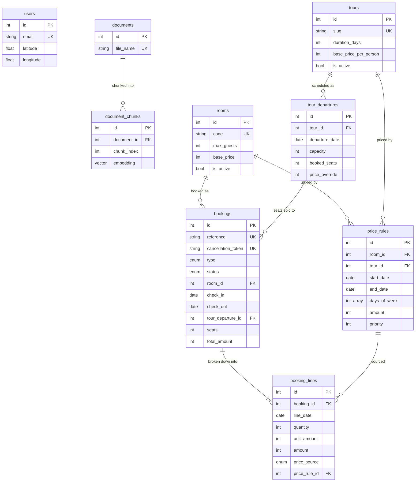

# Database Reference

The complete PostgreSQL schema behind the Thong Dong Retreat backend: every table, what it
is for, how the tables relate, and which rules the database itself enforces.

The source of truth is [`prisma/schema.prisma`](../prisma/schema.prisma) plus the
hand-written SQL in [`prisma/migrations/`](../prisma/migrations). This document explains
the *why*; the architectural rationale for the booking invariants lives in
[`ARCHITECTURE.md`](../ARCHITECTURE.md#data-model).

- **Engine:** PostgreSQL 17, one primary (`:5432`) plus a streaming read replica (`:5433`).
- **Extensions:** `vector` (pgvector, embeddings) and `btree_gist` (room overlap constraint).
- **Access:** Prisma 7 through `@app/database`. Only `api-user`, `api-chatbot` and
  `api-booking` open a connection; every other service reaches data over TCP or RabbitMQ.

---

## Conventions

| Convention | Rule |
|------------|------|
| Table names | `snake_case`, plural (`booking_lines`), mapped with `@@map` |
| Column names | `snake_case` in Postgres, `camelCase` in Prisma, mapped with `@map` |
| Primary keys | `id INTEGER GENERATED BY DEFAULT AS IDENTITY` (`@default(autoincrement())`) |
| Timestamps | `created_at` defaults to `now()`; `updated_at` maintained by Prisma `@updatedAt` |
| Dates | **Every temporal column is `timestamptz(3)`** (`@db.Timestamptz(3)`). There are no `date` columns |
| Money | Whole **VND** in `Int` columns. VND has no minor unit, so no scaling factor exists |
| Deletes | Catalogue rows are retired with `is_active = false`, never `DELETE` |

> **Date handling.** Nothing stored here is a calendar day; everything is an instant. Where
> a day still matters — counting nights, matching a price rule's `daysOfWeek`, deciding what
> is "in the past" — it is the **house** day, 00:00 in Asia/Ho_Chi_Minh (UTC+7, no DST).
> `apps/api-booking/src/domain/models/house-clock.ts` is the only place that conversion
> lives: `houseDayStart`, `houseDayIndex`, `houseWeekday`, `nowHouseDayStart`. Reading a
> weekday with `getUTCDay()` is wrong from 17:00Z onwards, which is already tomorrow on the
> ridge.

---

## Table map

Three independent groups share one database:

| Group | Tables | Owner service |
|-------|--------|---------------|
| Identity & geo | `users` | `api-user` |
| RAG knowledge base | `documents`, `document_chunks` | `api-chatbot` |
| Booking engine | `rooms`, `tours`, `tour_departures`, `price_rules`, `bookings`, `booking_lines` | `api-booking` |

There are **no foreign keys between the groups** — in particular a booking stores the
customer's name, email and phone directly and does not reference `users`, so guests can book
without an account and a later account edit never rewrites booking history.



---

## Identity

### `users`

Registered accounts for `api-user`, plus the last known position used by the "users near me"
search. Location is denormalised onto the user row on purpose: there is one current position
per user, no history is kept, and the geo search is a bounding-box scan that wants both
coordinates on the same row.

| Column | Type | Notes |
|--------|------|-------|
| `id` | `int` PK | auto-increment |
| `name` | `text` | |
| `email` | `text` UNIQUE | login identity |
| `password` | `text` | ⚠️ stored **in plaintext** and never verified — there is no login yet. `UserResponseDto` keeps it out of responses. See [README](../README.md) — this is a pre-auth codebase |
| `latitude` | `float?` | NULL until the user shares a position |
| `longitude` | `float?` | NULL until the user shares a position |
| `location_name` | `text?` | human label from reverse geocoding via `api-location` → Nominatim |
| `location_updated_at` | `timestamp?` | staleness check for the cached label |
| `created_at` / `updated_at` | `timestamptz` | |

**Indexes** — `users_email_key` (unique) for login;
`users_latitude_longitude_idx` for the bounding-box proximity query.

**Relationships** — none. Bookings intentionally do not point here (see above).

---

## Chatbot knowledge base

These two tables back the RAG pipeline in `api-chatbot`: a source file is ingested once,
split into chunks, and each chunk is embedded so the retriever can find the passages nearest
a question by cosine distance.

### `documents`

One row per ingested source file — the ingestion unit and the thing you re-ingest or delete.

| Column | Type | Notes |
|--------|------|-------|
| `id` | `int` PK | |
| `file_name` | `text` UNIQUE | natural key — re-ingesting the same file replaces it rather than duplicating |
| `created_at` / `updated_at` | `timestamptz` | |

**Relationships** — `documents 1 ──< document_chunks`, `ON DELETE CASCADE`: deleting a
document removes its chunks, since an orphan embedding is unretrievable noise.

### `document_chunks`

One retrievable passage: the text the model is shown plus the vector it is found by.

| Column | Type | Notes |
|--------|------|-------|
| `id` | `int` PK | |
| `document_id` | `int` FK → `documents.id` | cascade delete |
| `chunk_index` | `int` | position within the parent document; restores reading order |
| `content` | `text` | the passage injected into the prompt |
| `embedding` | `vector(1536)` | pgvector column |
| `created_at` | `timestamptz` | |

**Index** — `document_chunks_document_id_idx` for "fetch/replace all chunks of a document".

> **`embedding` is `Unsupported("vector(1536)")` in Prisma**, so the model API cannot read or
> write it. Inserts and similarity searches go through `$queryRaw` / `$executeRaw`. The
> `ivfflat` index created in `20260727103000` was dropped again in `20260808160756`; searches
> are exact scans, which is correct at the current corpus size and removes the need to keep
> re-adding an index Prisma's differ cannot see.

---

## Booking engine

Two products are sold through one booking table: **rooms** (priced per night, capacity is a
date range) and **tours** (priced per person, capacity is seats on a dated departure).

### `rooms`

The room catalogue — what can be sold, to how many people, at what nightly rate.

| Column | Type | Notes |
|--------|------|-------|
| `id` | `int` PK | |
| `code` | `text` UNIQUE | stable public identifier (e.g. `garden-suite`); the API looks rooms up by code, not id |
| `name` / `description` | `text` / `text?` | display copy |
| `max_guests` | `int` | occupancy cap, `> 0` |
| `base_price` | `int` | nightly rate in whole VND, overridable per night by `price_rules` |
| `is_active` | `bool` | soft retirement — hides the room while preserving its bookings |
| `created_at` / `updated_at` | `timestamptz` | |

**Relationships** — `rooms 1 ──< bookings` (`ON DELETE RESTRICT`) and
`rooms 1 ──< price_rules` (`ON DELETE CASCADE`). Restrict on bookings is deliberate:
booking history must outlive catalogue edits, so a room with bookings cannot be deleted at
all. Its price rules, by contrast, are meaningless without it and go with it.

**Checks** — `rooms_base_price_check`: `base_price >= 0 AND max_guests > 0`.
**Index** — `rooms_is_active_max_guests_idx` for "active rooms that sleep N".

### `tours`

The tour catalogue. A tour is a *template* — it has no date. Dates live in
`tour_departures`, because one tour runs many times.

| Column | Type | Notes |
|--------|------|-------|
| `id` | `int` PK | |
| `slug` | `text` UNIQUE | stable public identifier; the API looks tours up by slug |
| `name` / `description` | `text` / `text?` | display copy |
| `duration_days` | `int` | `> 0` |
| `base_price_per_person` | `int` | whole VND |
| `is_active` | `bool` | soft retirement |
| `created_at` / `updated_at` | `timestamptz` | |

**Relationships** — `tours 1 ──< tour_departures` (CASCADE) and
`tours 1 ──< price_rules` (CASCADE).
**Checks** — `tours_base_price_check`: `base_price_per_person >= 0 AND duration_days > 0`.

### `tour_departures`

A dated, seat-capped instance of a tour — the thing a customer actually buys a seat on.
Many bookings share one departure, which is exactly why the seat counter lives here and not
on the tour.

| Column | Type | Notes |
|--------|------|-------|
| `id` | `int` PK | |
| `tour_id` | `int` FK → `tours.id` | cascade |
| `departure_date` | `timestamptz` | The instant the journey leaves — the hour is part of it, so `(tour_id, departure_date)` permits a morning and an afternoon run on one day |
| `capacity` | `int` | total seats, `> 0` |
| `booked_seats` | `int` | seats held by PENDING + CONFIRMED + COMPLETED bookings |
| `price_override` | `int?` | per-person price for this departure only; **beats** any price rule |
| `status` | `departure_status` | `OPEN` / `CLOSED` / `CANCELLED` |
| `created_at` / `updated_at` | `timestamptz` | |

**Relationships** — `tour_departures 1 ──< bookings`, `ON DELETE RESTRICT` (history again).

**Constraints**
- `tour_departures_tour_id_departure_date_key` (unique) — one departure per tour per date.
- `tour_departures_capacity_check`: `capacity > 0`.
- `tour_departures_seats_check`: `0 <= booked_seats <= capacity` — the hard wall behind the
  overselling guarantee.
- `tour_departures_price_check`: `price_override IS NULL OR price_override >= 0`.

**Index** — `tour_departures_status_departure_date_idx` for the "open departures from today"
listing.

> `booked_seats` is a **denormalised counter**, maintained inside the same transaction as the
> booking write. It is incremented by a conditional `UPDATE` whose `WHERE` clause re-checks
> the remaining capacity; the `CHECK` constraint is the second wall in case someone writes
> the counter by another path. See
> [ARCHITECTURE.md](../ARCHITECTURE.md#invariants-enforced-by-the-database) for why this is
> correct at READ COMMITTED without `FOR UPDATE` and without a retry loop.

### `price_rules`

Time-and-weekday-based price overrides — weekend rates, seasonal pricing, promotions —
without editing the catalogue's base price.

| Column | Type | Notes |
|--------|------|-------|
| `id` | `int` PK | |
| `name` | `text` | operator-facing label ("Weekend rate") |
| `room_id` | `int?` FK → `rooms.id` | cascade |
| `tour_id` | `int?` FK → `tours.id` | cascade |
| `start_date` / `end_date` | `timestamptz?` | inclusive window of instants; NULL on a side = unbounded there. Whole-day windows open at `00:00` and close at `23:59:59.999` house time |
| `days_of_week` | `int[]` | Postgres DOW: `0` = Sunday … `6` = Saturday. Empty = every day in the window |
| `amount` | `int` | the overriding price — per night for rooms, per person for tours |
| `priority` | `int` | higher wins; ties broken by specificity, then window width, then recency |
| `is_active` | `bool` | |
| `created_at` / `updated_at` | `timestamptz` | |

**Relationships** — exactly one of `room_id` / `tour_id` is set (a rule targets one product,
never both and never neither). `price_rules 1 ──< booking_lines` records which rule produced
a frozen line, `ON DELETE SET NULL` — deleting a rule must not destroy history, and the
amount is frozen on the line anyway.

**Checks**
- `price_rules_target_check`: `num_nonnulls(room_id, tour_id) = 1`.
- `price_rules_window_check`: `end_date >= start_date` when both are set.
- `price_rules_dow_check`: `days_of_week <@ ARRAY[0,1,2,3,4,5,6]`.
- `price_rules_amount_check`: `amount >= 0`.

**Indexes** — one per target
(`price_rules_room_id_is_active_start_date_end_date_idx` and the `tour_id` twin), matching
the resolver's "active rules for this product overlapping this window" lookup.

**Resolution order** — rooms: winning rule → `rooms.base_price`. Tours: departure
`price_override` → winning rule → `tours.base_price_per_person`. Whichever wins is recorded
per line in `booking_lines.price_source`.

### `bookings`

One row per booking, and **one booking = one product**. The row is polymorphic over
`type`:

- `type = ROOM` uses `room_id`, `check_in`, `check_out`; `tour_departure_id` and `seats` are NULL.
- `type = TOUR` uses `tour_departure_id`, `seats`; `room_id`, `check_in`, `check_out` are NULL.

| Column | Type | Notes |
|--------|------|-------|
| `id` | `int` PK | |
| `reference` | `text` UNIQUE | human-facing code, e.g. `BK-7F3K9Q2A`. Quoted over the phone, printed in emails — deliberately short and **not a secret** |
| `cancellation_token` | `text` UNIQUE | bearer credential for the self-service cancel link: 32 random bytes, never derived from the reference, id or a timestamp, and never returned by an API response |
| `type` | `bookable_type` | `ROOM` / `TOUR` |
| `status` | `booking_status` | defaults to `PENDING` |
| `room_id` | `int?` FK → `rooms.id` | RESTRICT |
| `check_in` / `check_out` | `timestamptz?` | the instants the guest picked; half-open `[check_in, check_out)`, and they must fall on different house days |
| `tour_departure_id` | `int?` FK → `tour_departures.id` | RESTRICT |
| `seats` | `int?` | tour seat count |
| `guests` | `int` | party size, `> 0` |
| `customer_name` / `customer_email` / `customer_phone` | `text` | captured on the booking, not a `users` FK |
| `total_amount` | `int` | frozen grand total in VND; equals `SUM(booking_lines.amount)` |
| `currency` | `text` | defaults to `VND`; present so multi-currency is a data change, not a schema change |
| `notes` | `text?` | customer request |
| `hold_expires_at` | `timestamp?` | when a `PENDING` hold lapses; the sweep flips it to `EXPIRED` |
| `confirmed_at` / `cancelled_at` / `completed_at` | `timestamp?` | lifecycle stamps |
| `created_at` / `updated_at` | `timestamptz` | |

**Lifecycle**

```
PENDING ──confirm──> CONFIRMED ──daily job──> COMPLETED
   │                     │
   ├── hold lapses ──> EXPIRED        └── cancel ──> CANCELLED
   └── cancel ──────> CANCELLED
```

`PENDING`, `CONFIRMED` and `COMPLETED` all **hold a slot**. `CANCELLED` and `EXPIRED`
release it. `CONFIRMED` is the explicit step that fires the emails; `COMPLETED` is set by the
daily job once the stay or departure has elapsed.

**Constraints**
- `bookings_shape_check` — enforces the polymorphic shape above, so a ROOM row can never
  carry seats and a TOUR row can never carry dates.
- `bookings_room_no_overlap` — **the** invariant:
  `EXCLUDE USING gist (room_id WITH =, tstzrange(check_in, check_out, '[)') WITH &&)`
  restricted to slot-holding statuses. No two slot-holding bookings can overlap on the same
  room, regardless of application correctness. The half-open range over instants makes
  same-day turnover legal (a checkout at 11:00 and a check-in at 13:00 do not collide), and the partial predicate
  means cancelling frees the dates atomically, with no compensating write. A losing insert
  raises SQLSTATE `23P01`, which the repository maps to a `ConflictError`.
- `bookings_total_check`: `total_amount >= 0 AND guests > 0`.

**Indexes**
| Index | Serves |
|-------|--------|
| `bookings_room_id_status_check_in_check_out_idx` | room availability calendar |
| `bookings_tour_departure_id_status_idx` | seats sold per departure |
| `bookings_status_hold_expires_at_idx` | the expiry sweep |
| `bookings_customer_email_created_at_idx` | "my bookings" lookup by email |

### `booking_lines`

The **frozen price breakdown** — one row per stay night for rooms, one row for a tour
booking. These rows are never recomputed, so a later change to a base price or a price rule
cannot rewrite what a customer was charged.

| Column | Type | Notes |
|--------|------|-------|
| `id` | `int` PK | |
| `booking_id` | `int` FK → `bookings.id` | cascade — lines are worthless without their booking |
| `line_date` | `timestamptz` | the instant a stay night begins on the house clock (00:00 +07), one row per night; the departure instant for tours |
| `quantity` | `int` | `1` per night for rooms; seat count for tours |
| `unit_amount` | `int` | frozen unit price in VND at the moment of booking |
| `amount` | `int` | `quantity * unit_amount`, frozen |
| `price_source` | `price_source` | `BASE` / `RULE` / `DEPARTURE_OVERRIDE` — lets a receipt explain itself |
| `price_rule_id` | `int?` FK → `price_rules.id` | `ON DELETE SET NULL` |
| `created_at` | `timestamptz` | |

**Constraints**
- `booking_lines_booking_id_line_date_key` (unique) — one line per booking per date, which
  makes a duplicated night impossible.
- `booking_lines_amount_check`: `quantity > 0 AND unit_amount >= 0 AND amount = quantity * unit_amount`.

**Indexes** — `booking_lines_price_rule_id_idx` (which bookings a rule priced) and
`booking_lines_line_date_idx` (revenue by date).

> `bookings.total_amount` and the lines are written from the **same in-memory quote** inside
> one transaction, produced by a pure function in
> `apps/api-booking/src/domain/services/price-calculator.ts` — so the header total and the
> breakdown cannot diverge.

---

## Enums

| Enum (Postgres type) | Values | Meaning |
|----------------------|--------|---------|
| `booking_status` | `PENDING`, `CONFIRMED`, `COMPLETED`, `CANCELLED`, `EXPIRED` | the first three hold a slot; the last two release it |
| `bookable_type` | `ROOM`, `TOUR` | which shape a `bookings` row takes |
| `departure_status` | `OPEN`, `CLOSED`, `CANCELLED` | whether a departure can still be sold |
| `price_source` | `BASE`, `RULE`, `DEPARTURE_OVERRIDE` | where a frozen line price came from |

---

## Referential-action summary

Every FK's `ON DELETE` is a deliberate choice, not a default:

| Relationship | Action | Why |
|--------------|--------|-----|
| `documents` → `document_chunks` | CASCADE | an orphan embedding is unretrievable noise |
| `tours` → `tour_departures` | CASCADE | a departure has no meaning without its tour |
| `rooms`/`tours` → `price_rules` | CASCADE | a rule targets exactly one product |
| `rooms` → `bookings` | **RESTRICT** | booking history must outlive catalogue edits — retire with `is_active = false` |
| `tour_departures` → `bookings` | **RESTRICT** | same |
| `bookings` → `booking_lines` | CASCADE | the breakdown belongs to the booking |
| `price_rules` → `booking_lines` | **SET NULL** | deleting a rule must not destroy history; the amount is already frozen |

---

## Working with the schema

```bash
npx prisma migrate dev --name <short_snake_case> --create-only   # then hand-edit the SQL
npx prisma migrate dev        # apply
npx prisma generate
npx prisma db seed            # Thong Dong Retreat catalogue, idempotent on natural keys
npx prisma migrate deploy     # CI / production — never `migrate dev`
```

The seed is idempotent through natural keys (`rooms.code`, `tours.slug`,
`(tour_id, departure_date)`), and seeds departures relative to seed time so a fresh database
always has something in the future to sell.

### Migration footguns

Prisma models neither `CHECK` nor `EXCLUDE`, and its differ cannot see anything created by
hand-written SQL. Two consequences, both of which have already bitten this schema:

1. **Generated `DROP`s.** `bookings_room_no_overlap` creates a GiST index that appears in
   `pg_index` but not in `schema.prisma`, so *every* later `prisma migrate dev` emits a `DROP`
   for it. Delete that line by hand — same as the old `ivfflat` index and the uuid defaults.
2. **Silent constraint loss.** Postgres drops any constraint mentioning a column that gets
   dropped — which is what a column *retype* is under the hood.
   `20260810082416_use_int_autoincrement_ids` retyped `room_id`, `tour_id` and
   `tour_departure_id`, and would have taken `bookings_shape_check`,
   `bookings_room_no_overlap` and `price_rules_target_check` with them; that migration drops
   and recreates all three by hand.

After any migration touching those columns, verify the constraints survived:

```sql
SELECT conrelid::regclass, conname FROM pg_constraint
WHERE connamespace = 'public'::regnamespace AND contype IN ('c', 'x') ORDER BY 1, 2;
```

### Read replica

`@app/database` attaches `@prisma/extension-read-replicas`, so model reads
(`prisma.room.findMany`) route to the replica automatically while writes go to the primary.
Reads that immediately precede a write — availability checks, seat counts — must be pinned to
the primary (`$primary()`), because replication lag would let a stale read decide a write.
Browse and history reads are lag-tolerant and stay on the replica.

---

## Migration history

| Migration | What it did |
|-----------|-------------|
| `20260714072222_init` | `users` |
| `20260714075117_add_user_location` | `latitude` / `longitude` |
| `20260714083715_add_location_name` | `location_name`, `location_updated_at` |
| `20260727103000_add_documents_embeddings` | pgvector, `documents`, `document_chunks` |
| `20260728073907_add_db_uuid_default` | `gen_random_uuid()` defaults (later reverted) |
| `20260806082509_add_user_location_index` | bounding-box index on `users` |
| `20260808150946_add_booking_domain` | the six booking tables, four enums, all CHECKs, the EXCLUDE constraint |
| `20260808160756_drop_vector_index_and_uuid_defaults` | dropped the `ivfflat` index and the uuid defaults |
| `20260810082416_use_int_autoincrement_ids` | retyped every PK/FK from `text` uuid to `int` identity; recreated the constraints Postgres dropped along the way |
